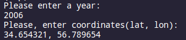
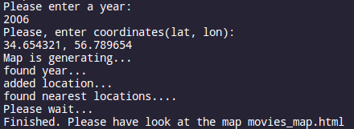
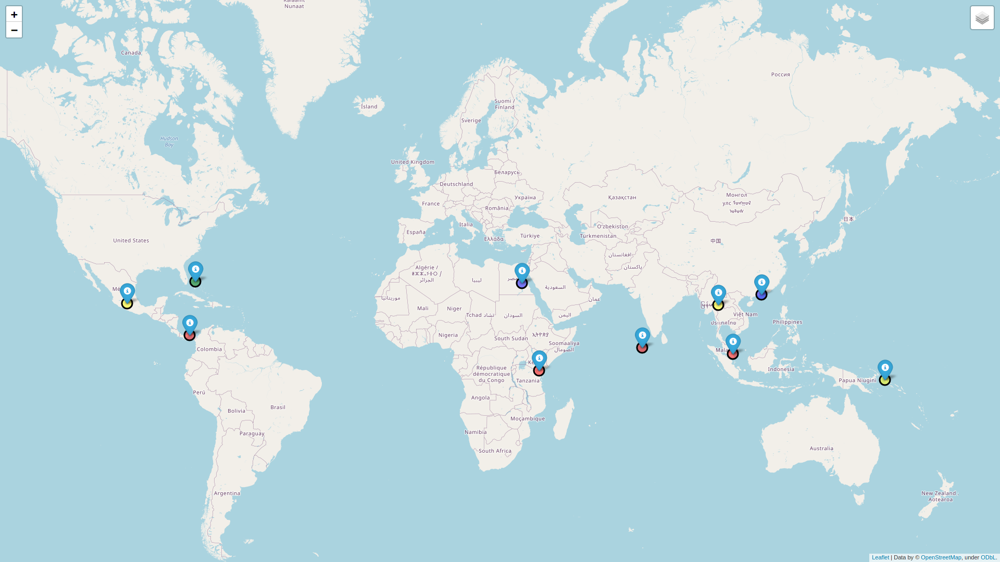
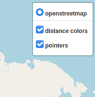
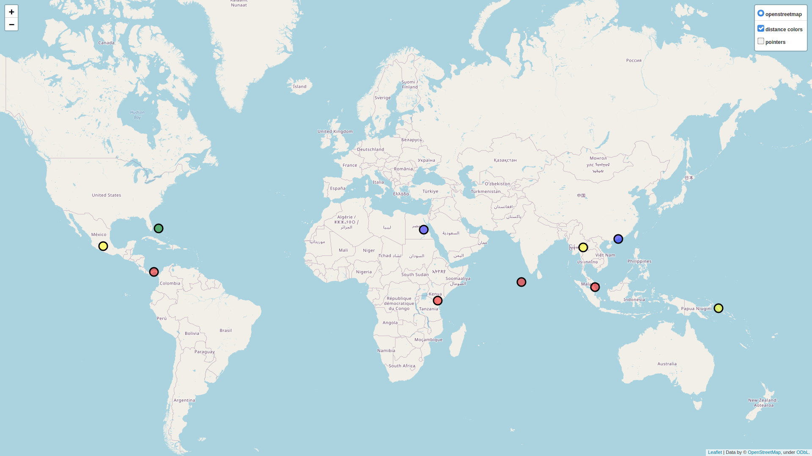

# map
main.py is a module which works with data from location.csv
The user should input the year (s)he wants and any coordinates
in form like 'lat, lon'. Here is an example:

Then the next functions will create a DataFrame with only films of
a certain year, add columns with previously calculated latitude,  
lontitude and distance. Then all these data will be saved in another
cvs file -- final.csv and they will be transformed into html file -- 
movies_map.html.

During the whole process the module will print some text in order not 
to bore the user with waiting:

Then the movies_map.html appears which the user has to run in his/her
own. As the result, a map with pointers appears:

This map has three layers:

There is a layer with pointers:

Also there is another one with circles that show how fat the locations
are:

The color of the circles changes with distance from the given location:
red(which are the closest) -> yellow -> green -> blue 

